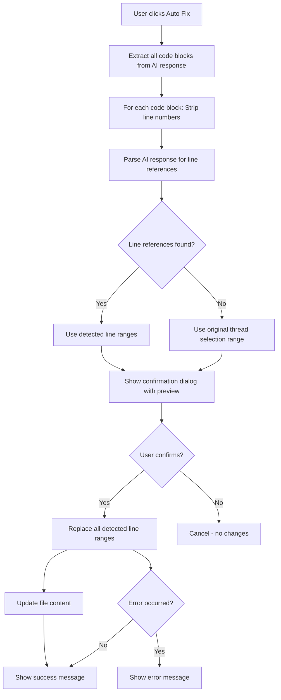

# Exact Line Code Replacement Implementation

## Problem

Currently, the "Auto Fix" feature replaces the entire file with AI-generated code, which can include incorrect line numbers from the prompt. We need to:

1. Strip line numbers from AI-generated code
2. Detect which specific lines the AI is referring to
3. Apply changes only to those exact lines (not the entire file)

## Solution Architecture

### 1. Create Line Number Stripping Utility

**File**: `src/utils/codeExtractor.ts` (new)

Create utility functions to:

- Strip line numbers in various formats:
  - `"   5 | const x = 1"` → `"const x = 1"`
  - `"5: const x = 1"` → `"const x = 1"`
  - `"Line 5: const x = 1"` → `"const x = 1"`
- Handle code blocks with line numbers
- Preserve indentation after stripping line numbers

### 2. Create Smart Code Parser

**File**: `src/utils/codeExtractor.ts` (extend)

Create functions to:

- Parse AI responses to extract:
  - Line range references (e.g., "lines 5-10", "line 7")
  - Code blocks with corrections
  - Context about which lines to replace
- Match extracted code to original file lines
- Handle multiple code blocks in a single response

### 3. Create Line Replacement Utility

**File**: `src/utils/codeReplacer.ts` (new)

Create function to:

- Replace specific line ranges in file content
- Preserve surrounding code
- Handle edge cases (empty lines, whitespace, etc.)

### 4. Update FeedbackBlocks Component

**File**: `src/components/ThreadPanel/FeedbackBlocks.tsx`

Modify `handleAutoFix` function to:

- Extract ALL code blocks from AI response (handle multiple fixes)
- Use new utilities to strip line numbers from each code block
- Parse AI response to detect line references for each code block
- Extract clean code (without line numbers) for each fix
- Show confirmation dialog with preview of which lines will be changed
- Apply ALL detected fixes (if multiple code blocks found)
- Fall back to original selection range if line detection fails
- If fallback also fails, show error message to user

### 5. Update Prompt Builder (Optional Enhancement)

**File**: `src/services/ai/promptBuilder.ts`

Consider adding instructions to AI to:

- Explicitly mention line numbers when providing fixes
- Format code blocks without line numbers
- Use clear markers for line ranges

## Implementation Details

### Code Extractor Functions

```typescript
// Strip line numbers from code
function stripLineNumbers(code: string): string

// Extract line range references from text
function extractLineReferences(text: string): Array<{start: number, end: number}>

// Extract code blocks and match to line ranges
function extractCodeWithLineInfo(response: string, originalCode: string, selectionRange: {startLine: number, endLine: number}): {
  code: string,
  lineRange: {startLine: number, endLine: number}
}
```

### Code Replacer Function

```typescript
// Replace lines in file content
function replaceLines(
  fileContent: string,
  startLine: number,
  endLine: number,
  newCode: string
): string

// Apply multiple replacements (sorted by line number, applied in reverse order to preserve line numbers)
function applyMultipleReplacements(
  fileContent: string,
  replacements: Array<{startLine: number, endLine: number, newCode: string}>
): string
```

### Confirmation Dialog Component

```typescript
interface CodeFix {
  startLine: number
  endLine: number
  originalCode: string
  newCode: string
}

interface CodeFixPreviewDialogProps {
  isOpen: boolean
  onClose: () => void
  onConfirm: () => void
  fixes: CodeFix[]
  fileName: string
}
```

The dialog will:

- Show each fix with "before" and "after" code preview
- Display line numbers being changed
- Have "Cancel" and "Apply All Fixes" buttons
- Match the app's glass-morphism design style

### Updated Auto Fix Flow



## Files to Modify

1. **New**: `src/utils/codeExtractor.ts` - Line number stripping and code extraction
2. **New**: `src/utils/codeReplacer.ts` - Line replacement utilities  
3. **New**: `src/components/CodeFixPreviewDialog/CodeFixPreviewDialog.tsx` - Confirmation dialog with preview
4. **Modify**: `src/components/ThreadPanel/FeedbackBlocks.tsx` - Update `handleAutoFix`
5. **Optional**: `src/services/ai/promptBuilder.ts` - Enhance AI instructions

## User Requirements (from clarification)

1. **Confirmation Dialog**: Show preview of which lines will change and ask user for confirmation before applying
2. **Multiple Code Blocks**: Apply ALL fixes automatically (if AI response contains multiple code blocks for different line ranges)
3. **Error Handling**: Try fallback to original selection range first, then show error message if that also fails

## Edge Cases to Handle

1. **Multiple code blocks**: Apply ALL code blocks automatically
2. **No line references**: Fall back to original selection range
3. **Line number formats**: Support various formats (padded, with pipes, colons, etc.)
4. **Code with indentation**: Preserve relative indentation after stripping line numbers
5. **Partial line replacements**: Handle when AI suggests changes to part of a line
6. **Multi-range replacements**: Support multiple non-contiguous line range replacements

## Testing Considerations

- Test with various line number formats
- Test with code blocks that have/without line numbers
- Test with AI responses that reference specific lines vs. general fixes
- Test edge cases (empty code, single line, entire file)
- Test with different code languages (preserve syntax)

## Success Criteria

- Line numbers are automatically stripped from AI-generated code
- Code changes apply only to the specific lines referenced (or original selection)
- Entire file is not replaced unless explicitly intended
- User can see which lines will be changed before applying
- Works with various line number formats in AI responses